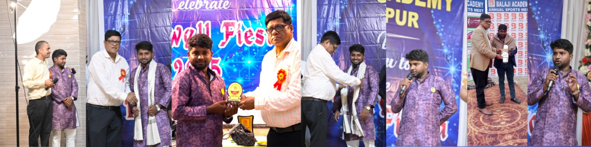

  

<h1 align="center">Hi 👋, I'm Ravi Kumar</h1>
<h3 align="center">🚀 Frontend & App Developer | India 🇮🇳</h3>

---

## 👨‍💻 About Me
- 🔭 I’m currently working on **React & React Native Projects**
- 🌱 Learning **Advanced Backend & Cloud (AWS)**
- 💬 Ask me about **JavaScript, React, React Native, Flutter**
- ⚡ Fun fact: I debug with chai ☕😄

---

## 🌐 Connect With Me

---

## 🚀 Tech Stack

### 💻 Frontend

### 📱 App Development

### 🛠 Backend & Database

### ⚙ Tools

---

## 📊 GitHub Stats

---

## 🔥 Contribution Graph

---

### 💡 Quote I Believe In
> “Code. Learn. Build. Repeat.” 🔁
